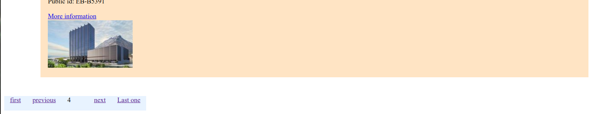
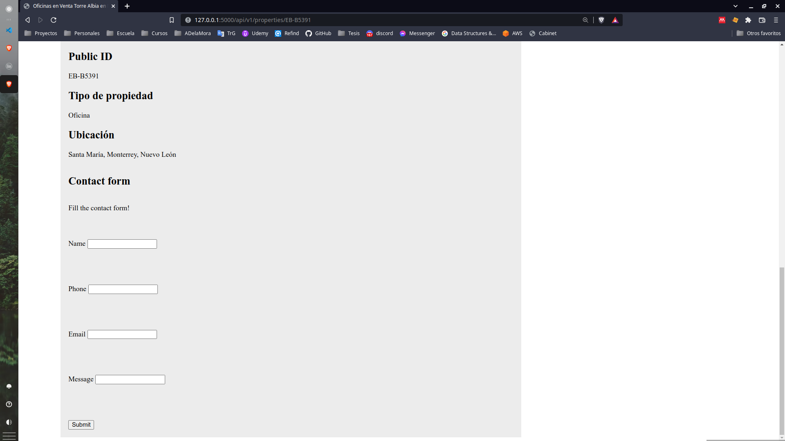
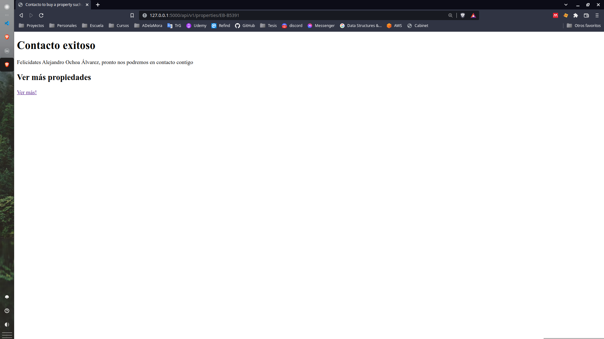

# Prueba técnica EasyBroker

The following project is the result of EasyBroker's technical test consisting of a page that consumes \n
resources through its API.

In this way, a web page for the sale, rent and purchase of properties is built using 2 main pages:

1. Properties List (HomePage): Page with a vintage style (as if it were from the 2000s), where letters of each property obtained from a request to the EasyBroker API are presented. Each letter includes basic property information and a view more button that takes you to the _property_ page.
   Pagination is used and 15 results are displayed per page.

2. Property profile: Page with a simple style that includes a greater amount of information and images of the property. Additionally, it includes a contact section. In which the user registers the data when he is interested in a property. This data is sent to EasyBroker, along with the ID of this property.

## Implementation

The API implementation was done using Flask for the backend and Jinja2 rendering engine for the frontend. This choice was made due to the agility that Flask provides for building simple and reliable applications. Despite being able to scale well to larger projects, in this case I would recommend migrating to more robust frameworks such as Django.

### How to run the project

The project has the following structure:

```
    .
    ├── app
    │ ├── home
    │ │ ├── static
    │ │ ├── template
    │ │ └── home.py
    │ ├── property
    │ │ ├── static
    │ │ ├── template
    │ │ └── property_profile.py
    ├── tests
    │ ├── functional
    │ ├── unit
    │ ├── conftest.py
    ├── config.py
    ├── README.md
    ├── requirements.txt
    └── wsgi.py
```

The packages used for the project are found in the requirements.txt file that can be installed using the following command:

    pip install -r ./requirements.txt

The packages used for the project are found in the requirements.txt file that can be installed using the following command:

    flask run

For production environment, an Procfile is configured to use with Gunicorn as the WSGI HTTP server. Which is compatible with Elastic Beanstalk configuration requirements.

### Tests

Pytest was used to to carry on the test task. Test are configured in the test folder whith the next tree:

```
    tests/
    ├── functional
    │   ├── test_home.py
    │   └── test_property_page.py
    ├── unit
    │   └── test_properties_home_page.py
    ├── conftest.py
    └── pytest.ini
```

Test where divided in two: functional test and unit test.

#### Unit test

Unit test where focused in testing small units of code such ad utility functions called by view functions.
Especially in home page, pagination was carried out by a function that calls the next, previus, last and first page page.

This function was tested for its behaibour under ok and bad responses from the API.

#### Fuctional test

In functional test views were tested for Home page (properties list), and por Property profile. Making sure that there was a response for calling the app using a test_clint fixure.

Also, EasyBroker API was tested in Property profile and for the contact form but marked with pytest decorator to avoide using it unless necessary.

## Notes

I think that testing in general was a little hard since I have not experience on it. So, this consume a lot of time, but after reading a lot of blogs I was able to write some good test, at least is what Im belive.

Also HTML and CSS are not my strengths so this makes reead a lot of blogs to. Moments like this makes me think in how hard frontend is.

I take kare that all views were clean, and all related with flask. Honestly HTML, CSS and posibly test were not that clean, but they are not that bad.

I was able to finish with the basic requirements, but I would like to implement a database integration to save information about the user information,, and properties that retanin the attention the most, so in the future implement and AI system recomendation.

Next, the web page is presented.

### Properties list page (Home page)

As we can see, the page is disegned to present the individual property main information as a card. All the properties where showed as the _published_ property was not found.
A squered card as a instagram profile page was considered but becouse of time constrains the design was not done.


#### Pagination in home

## THe pagination was done with simple buttons but big jumps to start and last page where consider.



### Property profile

The main property profile consist in basic data such as:

-   Public ID
-   Title
-   Description
-   The first image
-   Property type
-   Location
-   A contact form to create new leads

## Also, a section to see a miniature of all images of the current property where done


#### Contact form

A basic contact form inside the property profile was implemented using plain HTML. The submit button send the information to a EP where the EasyBroker is used to send the information to.
In this section, was considered create a users models to save information about the user and its interes, so in the future a rank system could be inplementes.


In case of succes, the user is redirected a very simple page where it is invited to continue viewing the other properties. A more styled page is required but due time constrains I was not able.

