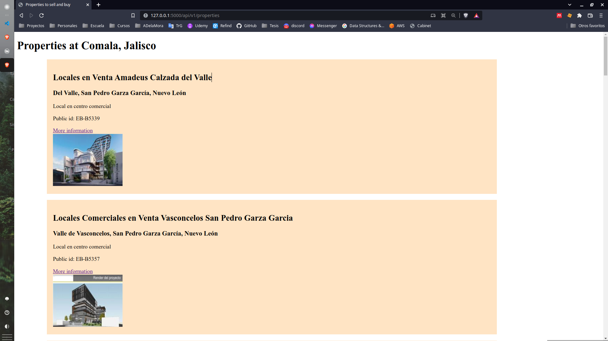
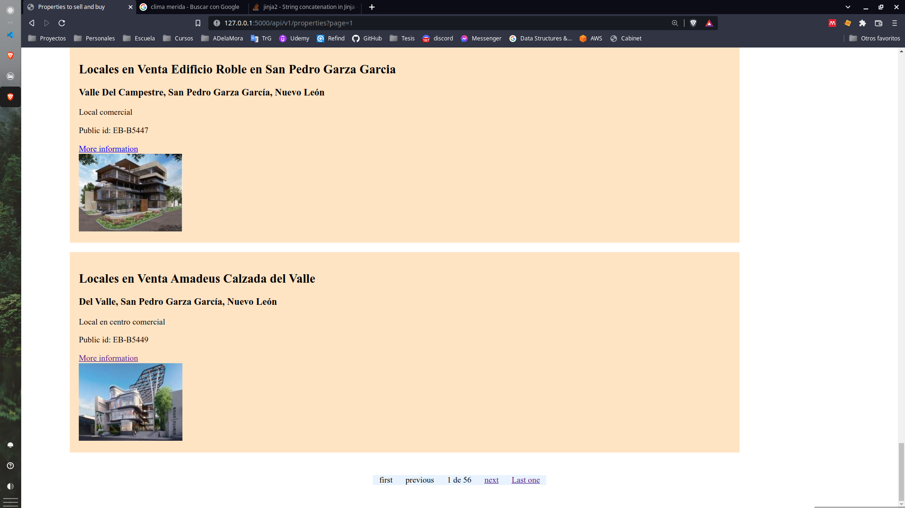
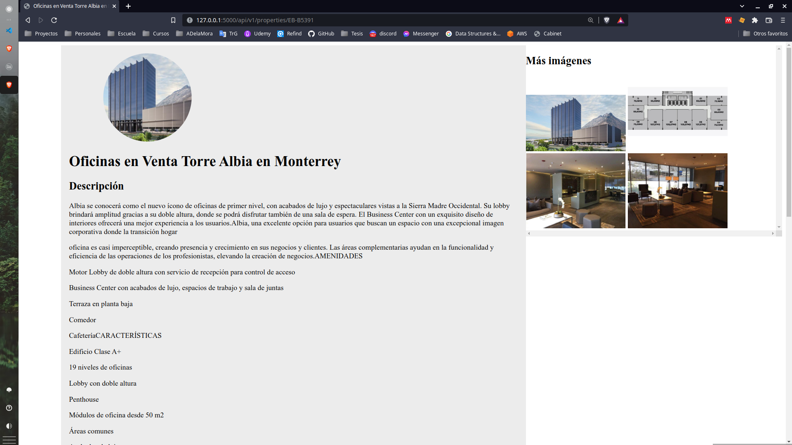

# Prueba técnica EasyBroker

El siguiente proyecto es el resultado de la prueba técnica de EasyBroker que consiste en una página que consume \n
los recursos mediante su API.

De tal forma, se construye una página web para la venta, renta y compra de propiedades utilizando 2 páginas principales:

1. Properties List (HomePage): Página con estilo vintage (como si fuera de los 2000), donde se presentan cartas de cada propiedad obtenida a partir de una petición a la API de EasyBroker. Cada carta incluye información básica de la propiedad y un botón de ver más que te lleva a la página _property_.
   Se utiliza una paginación y se muestran 15 resultados por página.

2. Property profile: Página con estilo sencillo que incluye una mayor cantidad de información e imagenes de la propiedad. Adicionalmente incluye una sección de contacto. En la cual el usuario registra los datos cuando se encuentre interesado en una propiedad. Estos datos son enviados a EasyBroker, junto con el ID de esta propiedad.

## Implementación

La implementación de la API se realizó utilizando Flask para el backend y el motor de renderizado Jinja2 para el frontend. Se tomó esta elección debido a la agilidad que proporciona Flask para contruir aplicaciones sencillas y confiables. A pesar de poder escalar bien a proyectos de dimensiones mayores, en dicho caso combendrí migrar a frameworks más robustos como Django.

### Alzado del proyecto

El proyecto en cuention tiene la siguiente estructura:

```
    .
    ├── app
    │ ├── home
    │ │ ├── static
    │ │ ├── template
    │ │ └── home.py
    │ ├── property
    │ │ ├── static
    │ │ ├── template
    │ │ └── property_profile.py
    ├── tests
    │ ├── functional
    │ ├── unit
    │ ├── conftest.py
    ├── config.py
    ├── README.md
    ├── requirements.txt
    └── wsgi.py
```

Los paquetes utilizados para el proyecto se encuentran en el archivo requirements.txt que pueden ser instalados mediante el siguente comando:

    pip install -r ./requirements.txt

Una vez replicado en virtual environment, es posible alzar el servidor usando la CLI de flask con el siguiente commando:

    flask run

For production environment, an Procfile is configured to use with Gunicorn as the WSGI HTTP server. Which is compatible with Elastic Beanstalk configuration requirements.

### Tests

Pytest was used to to carry on the test task. Test are configured in the test folder whith the next tree:

```
    tests/
    ├── functional
    │   ├── test_home.py
    │   └── test_property_page.py
    ├── unit
    │   └── test_properties_home_page.py
    ├── conftest.py
    └── pytest.ini
```

Test where divided in two: functional test and unit test.

#### Unit test

Unit test where focused in testing small units of code such ad utility functions called by view functions.
Especially in home page, pagination was carried out by a function that calls the next, previus, last and first page page.

This function was tested for its behaibour under ok and bad responses from the API.

#### Fuctional test

In functional test views were tested for Home page (properties list), and por Property profile. Making sure that there was a response for calling the app using a test_clint fixure.

Also, EasyBroker API was tested in Property profile and for the contact form but marked with pytest decorator to avoide using it unless necessary.

## Notes

I think that testing in general was a little hard since I have not experience on it. So, this consume a lot of time, but after reading a lot of blogs I was able to write some good test, at least is what Im belive.

Also HTML and CSS are not my strengths so this makes reead a lot of blogs to. Moments like this makes me think in how hard frontend is.

I take kare that all views were clean, and all related with flask. Honestly HTML, CSS and posibly test were not that clean, but they are not that bad.

I was able to finish with the basic requirements, but I would like to implement a database integration to save information about the user information,, and properties that retanin the attention the most, so in the future implement and AI system recomendation.

Next, the web page is presented.

### Properties list page (Home page)

As we can see, the page is disegned to present the individual property main information as a card. All the properties where showed as the _published_ property was not found.
A squered card as a instagram profile page was considered but becouse of time constrains the design was not done.



#### Pagination in home

THe pagination was done with simple buttons but big jumps to start and last page where consider.



### Property profile

The main property profile consist in basic data such as:

-   Public ID
-   Title
-   Description
-   The first image
-   Property type
-   Location
-   A contact form to create new leads

Also, a section to see a miniature of all images of the current property where done

