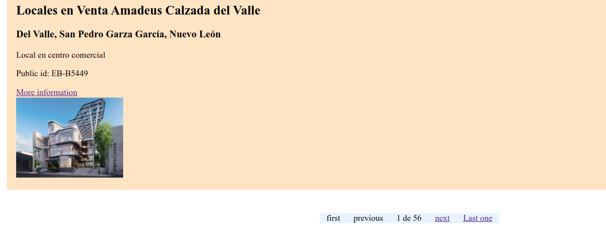
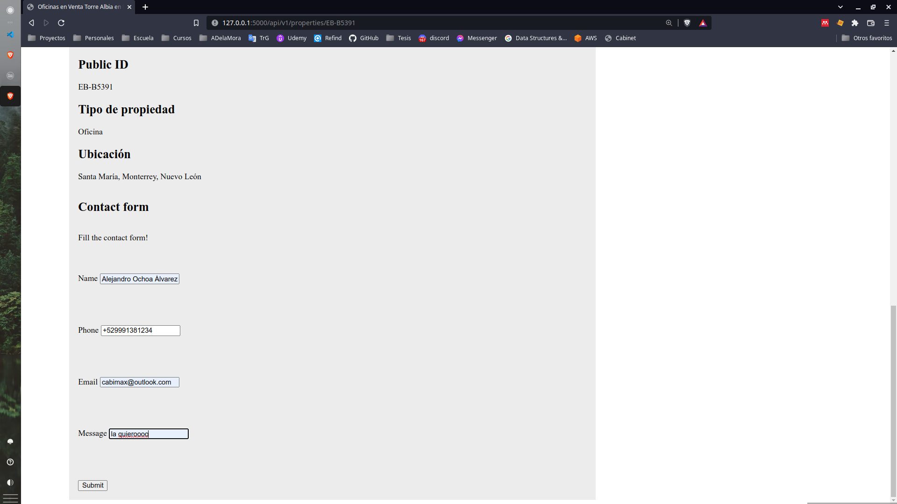

# Prueba técnica EasyBroker

The following project is the result of EasyBroker's technical test consisting of a page that consumes \n
resources through its API.

In this way, a web page for the sale, rent and purchase of properties is built using 2 main pages:

1. Properties List (HomePage): Page with a vintage style (as if it were from the 2000s), where letters of each property obtained from a request to the EasyBroker API are presented. Each letter includes basic property information and a view more button that takes you to the _property_ page.
   Pagination is used and 15 results are displayed per page.

2. Property profile: Page with a simple style that includes a greater amount of information and images of the property. Additionally, it includes a contact section. In which the user registers the data when he is interested in a property. This data is sent to EasyBroker, along with the ID of this property.

## Implementation

The API implementation was done using Flask for the backend and Jinja2 rendering engine for the frontend. This choice was made due to the agility that Flask provides for building simple and reliable applications. Despite being able to scale well to larger projects, in this case I would recommend migrating to more robust frameworks such as Django.

### How to run the project

The project has the following structure:

```
    .
    ├── app
    │ ├── home
    │ │ ├── static
    │ │ ├── template
    │ │ └── home.py
    │ ├── property
    │ │ ├── static
    │ │ ├── template
    │ │ └── property_profile.py
    ├── tests
    │ ├── functional
    │ ├── unit
    │ ├── conftest.py
    ├── config.py
    ├── README.md
    ├── requirements.txt
    └── wsgi.py
```

The packages used for the project are found in the requirements.txt file that can be installed using the following command:

    pip install -r ./requirements.txt

The packages used for the project are found in the requirements.txt file that can be installed using the following command:

    flask run

For production environment, an Procfile is configured to use with Gunicorn as the WSGI HTTP server. Which is compatible with Elastic Beanstalk configuration requirements.

An .env file with the following variables are required:

    EB_BASE_URL = *
    EB_TOKEN = *
    PREFIX = /api/v1/
    EB_PROPERTY_PUBLIC_ID = XX -XXXXX
    FLASK_DEBUG = *
    TEMPLATES_AUTO_RELOAD = *

The environment variables are clasified in 3 main working environments and handled using a congig class as follows:

```python
class BaseConfig:
    PREFIX = getenv('PREFIX')
    pass


class DevelopmentConfig(BaseConfig):
    TEMPLATES_AUTO_RELOAD = getenv('TEMPLATES_AUTO_RELOAD')
    FLASK_DEBUG = getenv('FLASK_DEBUG')

    EB_PROPERTY_PUBLIC_ID = getenv('EB_PROPERTY_PUBLIC_ID_DEVELOPMENT')
    EB_TOKEN = getenv('EB_TOKEN_DEVELOPMENT')
    EB_BASE_URL = getenv('EB_BASE_URL_DEVELOPMENT')


class ProductionConfig(DevelopmentConfig):
    TEMPLATES_AUTO_RELOAD = False
    FLASK_DEBUG = False

    EB_PROPERTY_PUBLIC_ID = getenv('EB_PROPERTY_PUBLIC_ID')
    EB_TOKEN = getenv('EB_TOKEN_PRODUCTION')
    EB_BASE_URL = ''


class TestingConfig(DevelopmentConfig):
    pass
```

### Tests

Pytest was used to carry on the test task. Test are configured in the test folder with the next tree:

```
    tests/
    ├── functional
    │   ├── test_home.py
    │   └── test_property_page.py
    ├── unit
    │   └── test_properties_home_page.py
    ├── conftest.py
    └── pytest.ini
```

Tests were divided in two: functional test and unit test and are carried out in development git branch.

#### Unit test

Unit tests were focused on testing small units of code such as utility functions called by view functions.
Especially on the home page, pagination was carried out by a function that calls the next, previous, last and first page page.

This function was tested for its behavior under ok and bad responses from the API.

#### Fuctional test

In functional test views were tested for Home page (properties list), and por Property profile. Making sure that there was a response for calling the app using a test_clint fixture.

Also, EasyBroker API was tested in Property profile and for the contact form but marked with pytest decorator to avoid using it unless necessary.

## Notes

I enjoyed making this simple project, because it made me feel that I was learning much of the HTML and CSS that I had forgotten. Working with easybroker API was easy since its documentation is clean, so it was very helpful. But what I enjoyed the most was learning about testing, since I wanted to learn about it since time ago.

I think that testing in general was a little hard since I have not experience on it. So, this consumes a lot of time, but after reading a lot of blogs I was able to write some good tests, at least that's what Im believe.

Also HTML and CSS are not my strengths so this makes me read a lot of blogs too. Moments like this make me think about how hard frontend is.

I take care that all views were clean, and all related with flask. Honestly HTML, CSS and possibly tests were not that clean, but they are not that bad.

I was able to finish with the basic requirements, but I would like to implement a database integration to save information about the user information,, and properties that retain the attention the most, so in the future implement an AI system recommendation.

Next, the web page is presented.

### Properties list page (Home page)

As we can see, the page is designed to present the individual property main information as a card. All the properties where shown as the _published_ property were not found.
A squared card as an instagram profile page was considered but because of time constraints the design was not done.

Orange color was selected since it is helpfull to make users feel more happy and energetic.


#### Pagination in home

The pagination was done with simple buttons but big jumps to start and last page where considered.



Two things were considered for pagination:

1. If you are on the first page, the first and previous buttons are disable as seen in the previous image.
2. If you are in the las page, next and last pages buttons are diable, as can be seen in next image

    

### Property profile

The main property profile consist in basic data such as:

-   Public ID
-   Title
-   Description
-   The first image
-   Property type
-   Location
-   A contact form to create new leads

Blue color was selected to make a contrast with orange color, since blue colors make feel users in a more profesional environment.
Also, a section to see a miniature of all images of the current property where done


#### Contact form

A basic contact form inside the property profile was implemented using plain HTML. The submit button sends the information to an EP where the EasyBroker is used to send the information to.
In this section, it was considered to create a users model to save information about the user and its interes, so in the future a rank system could be implemented.



In case of success, the user is redirected to a very simple page where it is invited to continue viewing the other properties. A more styled page is required but due time constraints I was not able.


